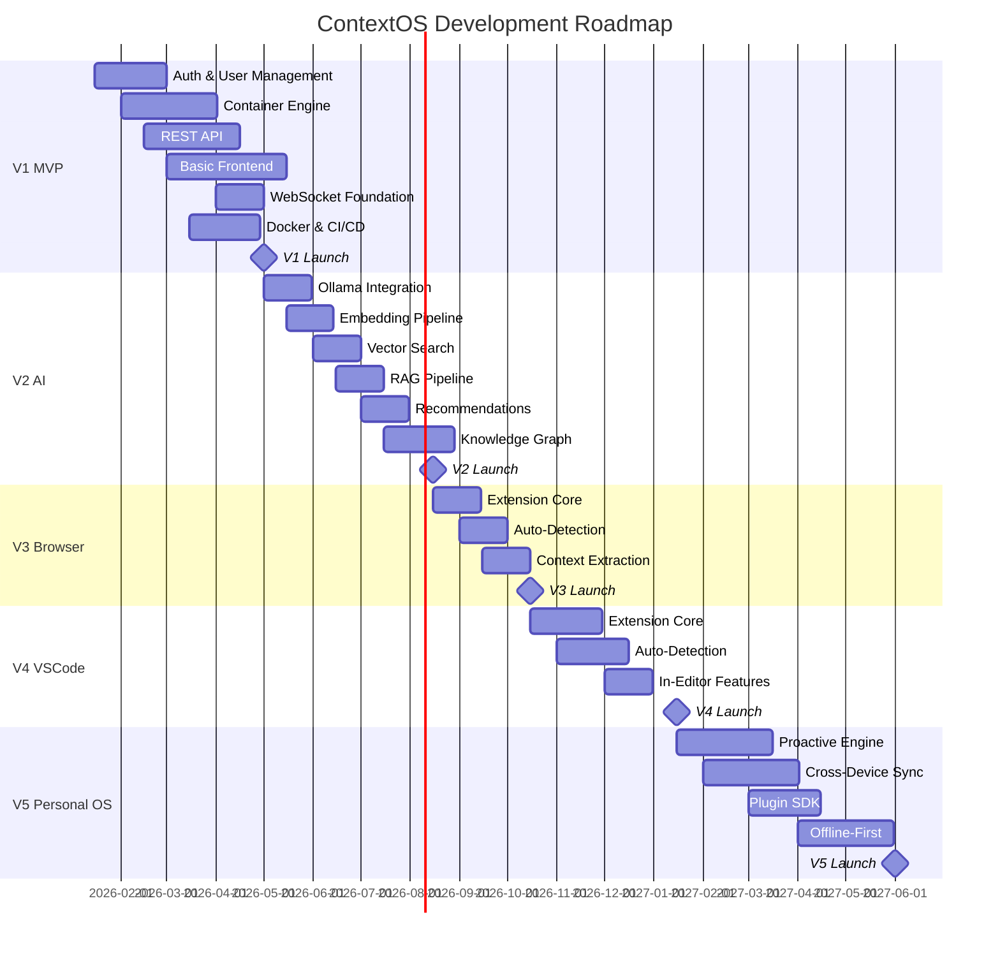

# Product Roadmap

## Phase Overview

```
Phase V1     Phase V2     Phase V3       Phase V4        Phase V5
──────────   ──────────   ───────────    ───────────     ──────────
MVP          AI           Browser        VSCode          Personal
             Integration  Extension      Integration     OS
───────      ───────      ────────       ────────        ────────
Q1-Q2 2026   Q2-Q3 2026   Q3-Q4 2026    Q1 2027         Q2-Q4 2027
```

---

## V1 — MVP (Q1-Q2 2026)

**Theme:** Core Container Management

### Epics

| Epic | Description | Priority |
|---|---|---|
| User Authentication | Registration, login, JWT, OAuth2, MFA | P0 |
| Container CRUD | Full create, read, update, delete for all container types | P0 |
| Container Types | Book, Movie, TV Series, Course, Learning, Project, Goal, Habit, Note, Snapshot, Pin, Knowledge Asset | P0 |
| Tag & Metadata | Flexible tagging system, custom metadata fields per container type | P0 |
| Search (Basic) | Full-text search across container titles, descriptions, and tags | P1 |
| Dashboard | Overview of recent activity, containers by type, progress summary | P1 |
| REST API | Complete documented API for all container operations | P0 |
| WebSocket Foundation | Real-time change notification infrastructure | P1 |
| Docker Deployment | Docker Compose setup for local development and self-hosting | P0 |
| CI/CD Pipeline | GitHub Actions for build, test, and deploy | P1 |

### Deliverables

- [ ] Spring Boot backend with complete REST API
- [ ] React + TypeScript frontend with container management UI
- [ ] PostgreSQL database with full schema and migrations
- [ ] JWT-based authentication with refresh tokens
- [ ] Basic dashboard with container overview
- [ ] Docker Compose one-command startup
- [ ] API documentation (OpenAPI 3.0)
- [ ] 85%+ test coverage on backend

### Risks

| Risk | Mitigation |
|---|---|
| Scope creep on container types | Strictly limit to 12 types for V1 |
| Performance with large datasets | Pagination, cursor-based queries, eager loading limits |
| UI complexity | Use component library, maintain design system |

---

## V2 — AI Integration (Q2-Q3 2026)

**Theme:** Intelligent Context Engine

### Epics

| Epic | Description | Priority |
|---|---|---|
| Ollama Integration | Local LLM for AI enrichment, no cloud dependency | P0 |
| Embedding Pipeline | Generate vector embeddings for all containers on create/update | P0 |
| Vector Search | Semantic search using pgvector or Qdrant | P0 |
| RAG Pipeline | Retrieve + Generate for context-aware answers | P0 |
| AI Enrichment | Auto-summarization, auto-tagging, relationship discovery | P1 |
| Recommendation Engine | Suggest related containers based on embeddings and user history | P1 |
| Knowledge Graph | Entity extraction and relationship mapping | P2 |
| WebSocket AI Updates | Real-time streaming of AI enrichment results | P1 |

### Deliverables

- [ ] Ollama integration with Spring AI
- [ ] Embedding service for all container types
- [ ] Vector search endpoint with hybrid (semantic + keyword) support
- [ ] RAG API for context-aware queries
- [ ] AI enrichment cron jobs
- [ ] Recommendation API
- [ ] Knowledge graph visualization
- [ ] AI model configuration UI

### Risks

| Risk | Mitigation |
|---|---|
| LLM latency for real-time features | Async processing with WebSocket streaming |
| Embedding quality | Multiple model options, user feedback loop |
| Hardware requirements for Ollama | Support remote Ollama instances, quantized models |

---

## V3 — Browser Extension (Q3-Q4 2026)

**Theme:** Web Context Capture

### Epics

| Epic | Description | Priority |
|---|---|---|
| Extension Core | Chrome/Firefox extension for web page capture | P0 |
| Auto-Detection | Detect page type (article, course, project, product) | P0 |
| One-Click Save | Capture page into appropriate container type | P0 |
| Context Extraction | Extract metadata, description, tags from page content | P1 |
| Sidebar UI | Quick access to containers and search from browser | P1 |
| Highlight Capture | Save highlighted text snippets to notes | P2 |

### Deliverables

- [ ] Chrome extension published
- [ ] Firefox extension published
- [ ] Auto-detection of 6+ page types
- [ ] One-click save to appropriate container
- [ ] Context extraction pipeline for web content
- [ ] Extension settings page

---

## V4 — VSCode Integration (Q1 2027)

**Theme:** Developer Context Awareness

### Epics

| Epic | Description | Priority |
|---|---|---|
| Extension Core | VSCode extension for project context management | P0 |
| Project Auto-Detection | Auto-detect project metadata from workspace | P0 |
| Code Snippet Capture | Save code snippets as Knowledge Assets | P1 |
| Tech Stack Tracking | Auto-detect dependencies, frameworks, languages | P1 |
| In-Editor Search | Search ContextOS containers without leaving VSCode | P1 |
| Commit Context | Link git commits to containers for context | P2 |

### Deliverables

- [ ] VSCode extension published on marketplace
- [ ] Auto-detection for Node, Python, Java, Go, Rust projects
- [ ] Code snippet management
- [ ] Tech stack auto-tracking
- [ ] In-editor semantic search

---

## V5 — Personal OS (Q2-Q4 2027)

**Theme:** Proactive Digital Life Management

### Epics

| Epic | Description | Priority |
|---|---|---|
| Proactive Intelligence | AI proactively surfaces relevant content based on context | P0 |
| Daily Context Brief | Morning briefing of relevant items, deadlines, suggestions | P0 |
| Cross-Device Sync | Seamless state across desktop, mobile, browser, and editor | P0 |
| Plugin SDK | Public SDK for building custom container types and integrations | P0 |
| Plugin Marketplace | Registry for community plugins | P1 |
| Advanced Analytics | Personal growth insights, time tracking, reading analytics | P1 |
| Offline-First Architecture | Full offline capability with sync when online | P0 |

### Deliverables

- [ ] Proactive notification and suggestion engine
- [ ] Daily context brief (morning digest)
- [ ] Cross-device synchronization
- [ ] Plugin SDK and documentation
- [ ] Plugin marketplace
- [ ] Personal analytics dashboard
- [ ] Offline-first with conflict-free sync

---

## Timeline Dependencies


