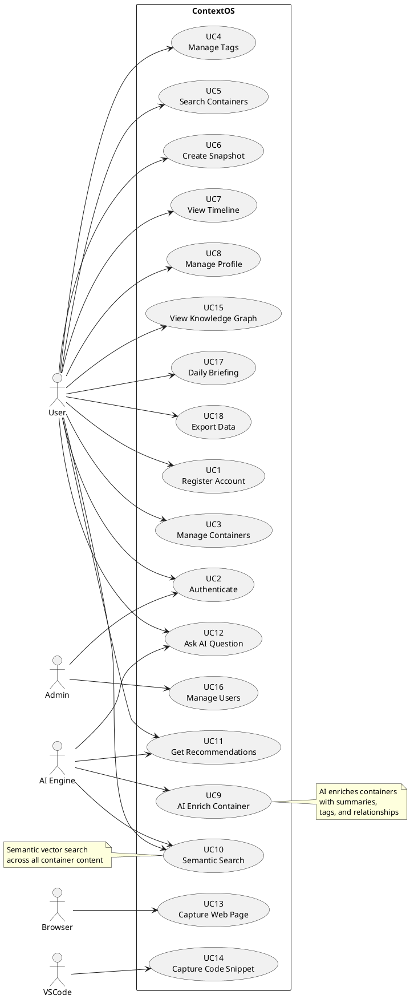

# Use Cases

## Use Case Diagram

---

## Detailed Use Cases

### UC1: Register Account

| Field | Value |
|---|---|
| **ID** | UC1 |
| **Name** | Register Account |
| **Actor** | User |
| **Trigger** | User visits login page and clicks "Register" |
| **Precondition** | User is not authenticated |
| **Postcondition** | User account created, email verification sent |

**Flow:**
1. User navigates to /register
2. System displays registration form
3. User enters email, password, display name
4. System validates input (email format, password strength)
5. System creates user account with hashed password
6. System sends verification email
7. System returns JWT tokens
8. User is redirected to dashboard

**Alternative Flows:**
- Email already exists → Show error, suggest login
- Password too weak → Show password requirements
- Invalid email format → Show validation error

### UC3: Manage Containers

| Field | Value |
|---|---|
| **ID** | UC3 |
| **Name** | Manage Containers |
| **Actor** | User |
| **Trigger** | User wants to create, view, edit, or delete a container |
| **Precondition** | User is authenticated |
| **Postcondition** | Container state reflects user's action |

**Flows:**

**3a: Create Container**
1. User clicks "New Container" on dashboard
2. User selects container type (Book, Movie, etc.)
3. System displays type-specific form
4. User fills in metadata fields
5. User adds tags (optional)
6. User clicks "Create"
7. System validates and saves container
8. System triggers AI enrichment pipeline (async)
9. System generates timeline event
10. System returns created container with ID
11. UI navigates to container detail

**3b: Update Container**
1. User navigates to container detail
2. User clicks "Edit"
3. System displays pre-filled form
4. User modifies fields
5. System validates changes
6. System saves and re-indexes for search
7. System generates snapshot (if configured)
8. System triggers AI re-enrichment (async)
9. WebSocket broadcasts change

**3c: Delete Container**
1. User views container detail
2. User clicks "Delete"
3. System asks for confirmation
4. User confirms
5. System soft-deletes container
6. System removes from search index
7. Timeline events retained for audit
8. WebSocket broadcasts deletion

### UC5: Search Containers

| Field | Value |
|---|---|
| **ID** | UC5 |
| **Name** | Search Containers |
| **Actor** | User |
| **Trigger** | User enters search query in search bar |
| **Precondition** | User is authenticated, containers exist |
| **Postcondition** | Search results displayed |

**Flow:**
1. User clicks search bar or presses Cmd+K
2. System shows recent searches and suggestions
3. User types search query
4. System performs hybrid search (full-text + vector)
5. System applies filters if specified
6. System returns ranked results
7. UI displays results with highlights
8. User can click to navigate to container

### UC9: AI Enrich Container

| Field | Value |
|---|---|
| **ID** | UC9 |
| **Name** | AI Enrich Container |
| **Actor** | AI Engine (System) |
| **Trigger** | Container created or updated |
| **Precondition** | Ollama is running, embedding model available |
| **Postcondition** | Container has AI-generated summary, tags, and embedding |

**Flow:**
1. Container creation/update event emitted
2. Async enrichment consumer receives event
3. System generates embedding via Ollama embedding API
4. System stores embedding in vector index
5. System generates summary (for supported types)
6. System generates suggested tags with confidence scores
7. System discovers related containers via vector similarity
8. System stores AI context on container
9. System fires enrichment complete event
10. WebSocket notifies UI of enrichment results

### UC10: Semantic Search

| Field | Value |
|---|---|
| **ID** | UC10 |
| **Name** | Semantic Search |
| **Actor** | User |
| **Trigger** | User performs natural language search |
| **Precondition** | Embeddings exist in vector index |
| **Postcondition** | Semantic results displayed alongside keyword results |

**Flow:**
1. User enters natural language query
2. System generates query embedding via Ollama
3. System performs vector similarity search
4. System performs keyword search (parallel)
5. System merges and re-ranks results using hybrid algorithm
6. System applies filters (type, tags, date, status)
7. System returns top-K results
8. UI displays results with relevance indicators

### UC12: Ask AI Question

| Field | Value |
|---|---|
| **ID** | UC12 |
| **Name** | Ask AI Question |
| **Actor** | User |
| **Trigger** | User asks a question in the AI query interface |
| **Precondition** | Ollama running, embeddings exist |
| **Postcondition** | AI-generated answer with citations displayed |

**Flow (RAG):**
1. User types question
2. System generates query embedding
3. System retrieves top-N relevant containers (vector search)
4. System retrieves relevant content from matched containers
5. System constructs prompt with context + question
6. System sends to Ollama LLM
7. System streams response back via WebSocket
8. UI displays answer with source citations
9. User can ask follow-up questions

### UC13: Capture Web Page

| Field | Value |
|---|---|
| **ID** | UC13 |
| **Name** | Capture Web Page |
| **Actor** | Browser (Extension) |
| **Trigger** | User clicks extension icon or uses keyboard shortcut |
| **Precondition** | Extension installed, user authenticated |
| **Postcondition** | Web page content saved as container |

**Flow:**
1. User navigates to a web page
2. User clicks ContextOS extension icon
3. Extension extracts page metadata (title, URL, description)
4. Extension auto-detects page type (article, documentation, etc.)
5. Extension shows preview with suggested container type
6. User can change type, add tags, select destination
7. User clicks "Save"
8. Extension sends data to ContextOS API
9. API creates container and triggers enrichment
10. Extension shows success notification
