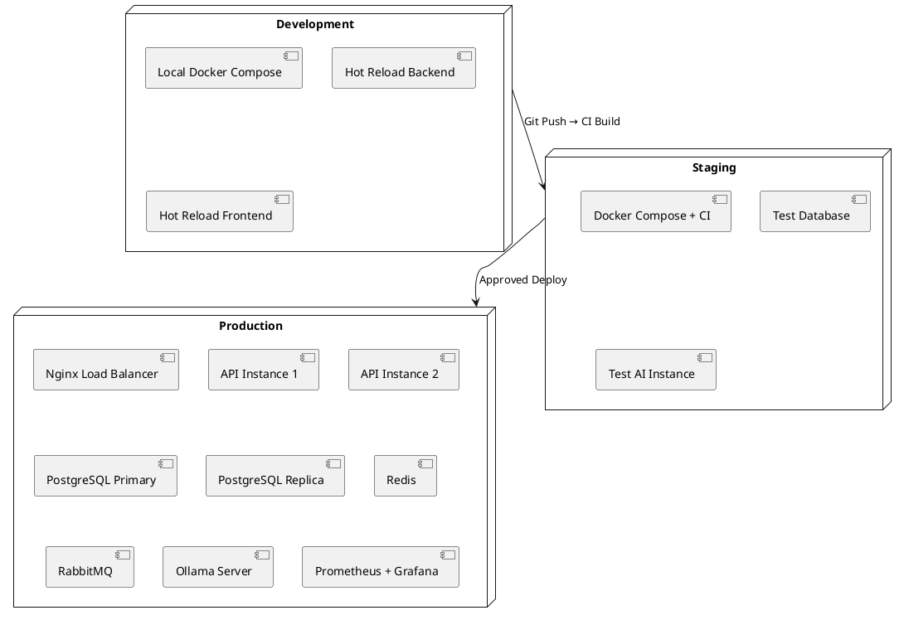

# Deployment Strategy

## Deployment Architecture Overview



## Deployment Environments

### 1. Development Environment

```yaml
Purpose: Local development on individual machines
Provisioning: Docker Compose (manual)
URL: http://localhost:5173 (frontend) / http://localhost:8080 (api)

Components:
  - Frontend: Vite dev server (HMR)
  - Backend: Spring Boot with devtools (hot reload)
  - PostgreSQL: Docker container (port 5432)
  - Redis: Docker container (port 6379)
  - RabbitMQ: Docker container (port 5672)
  - Ollama: Docker container (port 11434)
  - MailHog: Docker container (port 8025) — email testing

Data: Seeded test data, regenerated on demand
Monitoring: Spring Boot Actuator, basic logging
```

### 2. Staging Environment

```yaml
Purpose: Integration testing, QA verification
Provisioning: Docker Compose + GitHub Actions
URL: https://staging.contextos.dev

Components: Same as production but with:
  - Single API instance
  - Reduced resources (2GB RAM per service)
  - Test Ollama with smaller model (Llama 3.2 3B)
  - Ephemeral database (reset on each deploy)

Data: Anonymized production-like data
Monitoring: Prometheus + Grafana (basic)
CI Trigger: Push to main branch
Deploy: Automatic after CI passes
```

### 3. Production Environment

```yaml
Purpose: Live user-facing service
Provisioning: Docker Compose on VPS (Tier 1-2) / Kubernetes (Tier 3+)
URL: https://contextos.app

Components:
  - Nginx: TLS termination, rate limiting, static file serving
  - API: 2-3 instances behind Nginx (round-robin)
  - Frontend: Static files served by Nginx
  - PostgreSQL: Primary + async replica
  - Redis: Primary + replica
  - RabbitMQ: Single node with mirrored queues
  - Ollama: Dedicated server (GPU if available)
  - Prometheus + Grafana: Monitoring
  - Filebeat: Log shipping to ELK

Data: Production data with daily backups
Backup: PostgreSQL pg_dump (daily) + WAL streaming
Monitoring: Full Prometheus + Grafana + alerting
Uptime Target: 99.5%
```

## Docker Compose Configuration

```yaml
# docker-compose.yml (Production)
version: '3.8'

services:
  nginx:
    image: nginx:1.25-alpine
    ports:
      - "80:80"
      - "443:443"
    volumes:
      - ./nginx/nginx.conf:/etc/nginx/nginx.conf
      - ./nginx/ssl:/etc/nginx/ssl
      - ./frontend/dist:/usr/share/nginx/html
    depends_on:
      - api
    networks:
      - contextos

  api:
    build: ./backend
    image: contextos-api:latest
    environment:
      - SPRING_PROFILES_ACTIVE=prod
      - DB_URL=jdbc:postgresql://db:5432/contextos
      - DB_USERNAME=${DB_USERNAME}
      - DB_PASSWORD=${DB_PASSWORD}
      - REDIS_HOST=redis
      - RABBITMQ_HOST=rabbitmq
      - OLLAMA_URL=http://ollama:11434
      - JWT_SECRET=${JWT_SECRET}
    depends_on:
      - db
      - redis
      - rabbitmq
    restart: unless-stopped
    networks:
      - contextos
    deploy:
      replicas: 2

  db:
    image: postgres:16-alpine
    environment:
      - POSTGRES_DB=contextos
      - POSTGRES_USER=${DB_USERNAME}
      - POSTGRES_PASSWORD=${DB_PASSWORD}
    volumes:
      - pgdata:/var/lib/postgresql/data
      - ./init-db:/docker-entrypoint-initdb.d
    networks:
      - contextos
    restart: unless-stopped

  redis:
    image: redis:7-alpine
    volumes:
      - redis-data:/data
    networks:
      - contextos
    restart: unless-stopped

  rabbitmq:
    image: rabbitmq:3-management-alpine
    environment:
      - RABBITMQ_DEFAULT_USER=${RABBITMQ_USER}
      - RABBITMQ_DEFAULT_PASS=${RABBITMQ_PASSWORD}
    volumes:
      - rabbitmq-data:/var/lib/rabbitmq
    networks:
      - contextos
    restart: unless-stopped

  ollama:
    image: ollama/ollama:latest
    volumes:
      - ollama-data:/root/.ollama
    networks:
      - contextos
    restart: unless-stopped
    deploy:
      resources:
        reservations:
          devices:
            - driver: nvidia
              count: 1
              capabilities: [gpu]

  prometheus:
    image: prom/prometheus:latest
    volumes:
      - ./monitoring/prometheus.yml:/etc/prometheus/prometheus.yml
      - prometheus-data:/prometheus
    networks:
      - contextos
    restart: unless-stopped

  grafana:
    image: grafana/grafana:latest
    volumes:
      - grafana-data:/var/lib/grafana
    networks:
      - contextos
    restart: unless-stopped

volumes:
  pgdata:
  redis-data:
  rabbitmq-data:
  ollama-data:
  prometheus-data:
  grafana-data:

networks:
  contextos:
    driver: bridge
```

## Nginx Configuration

```nginx
# nginx/nginx.conf
upstream contextos-api {
    server api:8080;
    server api:8080;  # Second instance
}

server {
    listen 80;
    server_name contextos.app;
    return 301 https://$server_name$request_uri;
}

server {
    listen 443 ssl http2;
    server_name contextos.app;

    ssl_certificate /etc/nginx/ssl/cert.pem;
    ssl_certificate_key /etc/nginx/ssl/key.pem;

    # Security headers
    add_header Strict-Transport-Security "max-age=31536000; includeSubDomains" always;
    add_header X-Frame-Options "DENY" always;
    add_header X-Content-Type-Options "nosniff" always;
    add_header X-XSS-Protection "1; mode=block" always;

    # Frontend static files
    location / {
        root /usr/share/nginx/html;
        try_files $uri $uri/ /index.html;
        expires 1y;
        add_header Cache-Control "public, immutable";
    }

    # API proxy
    location /api/ {
        proxy_pass http://contextos-api;
        proxy_set_header Host $host;
        proxy_set_header X-Real-IP $remote_addr;
        proxy_set_header X-Forwarded-For $proxy_add_x_forwarded_for;
        proxy_set_header X-Forwarded-Proto $scheme;
    }

    # WebSocket proxy
    location /ws/ {
        proxy_pass http://contextos-api;
        proxy_http_version 1.1;
        proxy_set_header Upgrade $http_upgrade;
        proxy_set_header Connection "upgrade";
        proxy_set_header Host $host;
        proxy_read_timeout 86400;
    }

    # Rate limiting
    limit_req_zone $binary_remote_addr zone=api:10m rate=30r/s;
    location /api/ {
        limit_req zone=api burst=50 nodelay;
        proxy_pass http://contextos-api;
    }
}
```

## CI/CD Pipeline

```yaml
# .github/workflows/deploy.yml
name: ContextOS CI/CD

on:
  push:
    branches: [main, develop]
  pull_request:
    branches: [main]

jobs:
  test:
    runs-on: ubuntu-latest
    services:
      postgres:
        image: postgres:16-alpine
        env:
          POSTGRES_DB: contextos_test
          POSTGRES_USER: test
          POSTGRES_PASSWORD: test
        ports: [5432:5432]
      redis:
        image: redis:7-alpine
        ports: [6379:6379]

    steps:
      - uses: actions/checkout@v4
      - name: Setup Java 21
        uses: actions/setup-java@v4
        with:
          java-version: '21'
          distribution: 'temurin'
      - name: Backend Tests
        run: ./mvnw verify
      - name: Setup Node 20
        uses: actions/setup-node@v4
        with:
          node-version: '20'
      - name: Frontend Tests
        run: npm ci && npm run test

  build:
    needs: test
    runs-on: ubuntu-latest
    steps:
      - uses: actions/checkout@v4
      - name: Build Backend
        run: ./mvnw package -DskipTests
      - name: Build Frontend
        run: npm ci && npm run build
      - name: Build Docker Images
        run: docker compose build

  deploy:
    needs: build
    if: github.ref == 'refs/heads/main'
    runs-on: ubuntu-latest
    steps:
      - name: Deploy to Production
        run: |
          # SSH into server and deploy
          ssh ${{ secrets.DEPLOY_HOST }} '
            cd /opt/contextos &&
            git pull &&
            docker compose pull &&
            docker compose up -d --remove-orphans
          '
```

## Backup Strategy

```yaml
Backup Schedule:
  PostgreSQL:
    type: pg_dump (full) + WAL archiving
    full_backup: Daily at 02:00 UTC
    retention: 30 days
    location: /backups/postgres/
    cloud_copy: S3-compatible storage (encrypted)

  Redis:
    type: RDB snapshots
    schedule: Every 6 hours
    retention: 7 days

  Application Data:
    type: Volume snapshots
    schedule: Daily
    retention: 7 days

Restore Process:
  - Point-in-time recovery via WAL
  - Estimated RTO: 1 hour (full restore)
  - Estimated RPO: 5 minutes (WAL streaming)
```

## Rollback Strategy

```yaml
Rollback Triggers:
  - Error rate > 5% after deployment
  - API latency p95 > 1s
  - Database migration failure
  - Critical security vulnerability

Rollback Procedure:
  1. Revert Docker image to previous tag
  2. Run database rollback migration (if applicable)
  3. Restart services
  4. Verify health endpoints
  5. Monitor for 30 minutes

Database Rollback:
  - Flyway undo migrations (limited support)
  - Manual restore from backup if needed
  - Forward-only migrations preferred (avoid undo)
```
