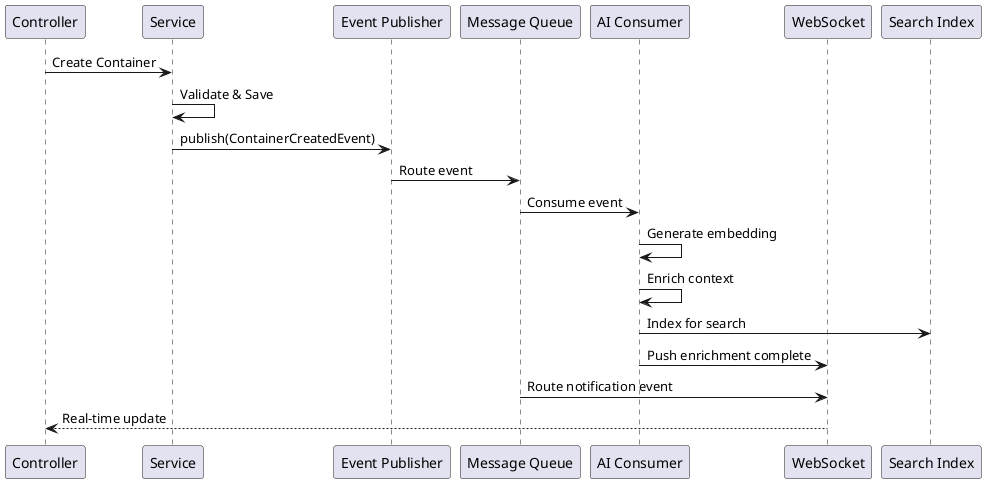

# Low-Level Architecture

## Domain Model

### Core Entity: Container

```java
// Base Container Entity
public abstract class Container {
    private UUID id;                    // Primary key
    private ContainerType type;          // BOOK, MOVIE, TV_SERIES, COURSE, etc.
    private String title;
    private String description;
    private ContainerStatus status;      // DRAFT, ACTIVE, COMPLETED, ARCHIVED, DELETED
    private Integer progressPercentage;  // 0-100
    private User owner;
    private Set<Tag> tags;
    private Set<MetadataEntry> metadata; // Type-specific key-value pairs
    private List<TimelineEvent> timeline;
    private List<Snapshot> snapshots;
    private AIContext aiContext;
    private LocalDateTime createdAt;
    private LocalDateTime updatedAt;
    private LocalDateTime deletedAt;     // Soft delete

    // Domain methods
    public void updateProgress(int percentage);
    public Snapshot createSnapshot();
    public void changeStatus(ContainerStatus newStatus);
    public void addMetadata(String key, String value);
    public void assignTag(Tag tag);
    public TimelineEvent recordEvent(TimelineEventType type);
}
```

### Container Type Hierarchy

```plantuml
@startuml Container_Hierarchy

abstract class Container {
  + UUID id
  + ContainerType type
  + String title
  + String description
  + ContainerStatus status
  + int progressPercentage
  + Set<Tag> tags
  + Set<MetadataEntry> metadata
  + AIContext aiContext
  + LocalDateTime createdAt
  + LocalDateTime updatedAt
}

class BookContainer {
  + String isbn
  + String author
  + int pageCount
  + int currentPage
  + String genre
  + BookStatus readingStatus
}

class MovieContainer {
  + String director
  + int releaseYear
  + int durationMinutes
  + String genre
  + String imdbRating
  + WatchStatus watchStatus
}

class TVSeriesContainer {
  + int seasons
  + int episodes
  + String network
  + String genre
  + WatchStatus watchStatus
}

class CourseContainer {
  + String platform
  + String instructor
  + int totalModules
  + int completedModules
  + int totalDurationHours
  + String certificateUrl
}

class LearningProgressContainer {
  + String skill
  + String proficiencyLevel
  + Set<String> resources
  + LocalDate targetDate
}

class SoftwareProjectContainer {
  + String repositoryUrl
  + String techStack
  + String projectType
  + String license
  + LocalDate startDate
  + LocalDate targetDate
}

class GoalContainer {
  + String objective
  + Set<KeyResult> keyResults
  + LocalDate deadline
  + GoalCategory category
}

class HabitContainer {
  + String habitName
  + HabitFrequency frequency
  + int targetCount
  + int currentStreak
  + int longestStreak
  + LocalTime reminderTime
}

class NoteContainer {
  + String content (rich text)
  + Set<String> attachments
  + String source
}

class SnapshotContainer {
  + UUID sourceContainerId
  + String snapshotData (JSON)
  + String label
}

class PinnedContentContainer {
  + String url
  + String siteName
  + String excerpt
  + String imageUrl
}

class KnowledgeAssetContainer {
  + String assetType (SNIPPET, QUOTE, CONCEPT, PATTERN)
  + String content
  + String source
  + String language (for code)
}

Container <|-- BookContainer
Container <|-- MovieContainer
Container <|-- TVSeriesContainer
Container <|-- CourseContainer
Container <|-- LearningProgressContainer
Container <|-- SoftwareProjectContainer
Container <|-- GoalContainer
Container <|-- HabitContainer
Container <|-- NoteContainer
Container <|-- SnapshotContainer
Container <|-- PinnedContentContainer
Container <|-- KnowledgeAssetContainer

@enduml
```



## Service Layer Architecture

### Service Pattern

Every bounded context follows this service pattern:

```java
public interface ContainerService {
    Container create(CreateContainerRequest request);
    Optional<Container> findById(UUID id);
    Page<Container> search(ContainerSearchCriteria criteria);
    Container update(UUID id, UpdateContainerRequest request);
    void delete(UUID id);
    Container archive(UUID id);
    Container restore(UUID id);
}

public class ContainerServiceImpl implements ContainerService {
    private final ContainerRepository repository;
    private final ContainerValidator validator;
    private final ContainerMapper mapper;
    private final EventPublisher eventPublisher;
    private final CacheManager cache;

    @Override
    @Transactional
    public Container create(CreateContainerRequest request) {
        validator.validateCreate(request);
        Container container = mapper.toEntity(request);
        container = repository.save(container);
        cache.evict(container.getType().name());
        eventPublisher.publish(new ContainerCreatedEvent(container));
        return container;
    }

    @Override
    @Transactional
    public Container update(UUID id, UpdateContainerRequest request) {
        Container container = findById(id).orElseThrow(ContainerNotFoundException::new);
        validator.validateUpdate(container, request);
        mapper.updateEntity(container, request);
        container = repository.save(container);
        cache.evict(container.getId().toString());
        eventPublisher.publish(new ContainerUpdatedEvent(container));
        return container;
    }
}
```

## Event-Driven Architecture

### Event Types

```java
// Container Events
public record ContainerCreatedEvent(Container container) implements DomainEvent {}
public record ContainerUpdatedEvent(Container container) implements DomainEvent {}
public record ContainerDeletedEvent(UUID containerId) implements DomainEvent {}
public record ContainerStatusChangedEvent(UUID containerId, ContainerStatus oldStatus, ContainerStatus newStatus) {}

// Snapshot Events
public record SnapshotCreatedEvent(UUID containerId, Snapshot snapshot) implements DomainEvent {}

// Timeline Events
public record TimelineEventRecordedEvent(UUID containerId, TimelineEvent event) implements DomainEvent {}

// AI Events
public record EnrichmentRequestedEvent(UUID containerId) implements DomainEvent {}
public record EnrichmentCompletedEvent(UUID containerId, AIContext context) implements DomainEvent {}
public record EmbeddingGeneratedEvent(UUID containerId, float[] embedding) implements DomainEvent {}
```

### Event Flow



## Repository Layer

```java
// Container Repository
@Repository
public interface ContainerRepository extends JpaRepository<Container, UUID> {
    Page<Container> findByOwnerId(UUID ownerId, Pageable pageable);
    Page<Container> findByTypeAndOwnerId(ContainerType type, UUID ownerId, Pageable pageable);
    Page<Container> findByStatusAndOwnerId(ContainerStatus status, UUID ownerId, Pageable pageable);

    @Query("SELECT c FROM Container c WHERE c.ownerId = :ownerId " +
           "AND (LOWER(c.title) LIKE LOWER(CONCAT('%', :query, '%')) " +
           "OR LOWER(c.description) LIKE LOWER(CONCAT('%', :query, '%')))")
    Page<Container> fullTextSearch(@Param("ownerId") UUID ownerId,
                                    @Param("query") String query,
                                    Pageable pageable);
}

// Tag Repository
@Repository
public interface TagRepository extends JpaRepository<Tag, UUID> {
    Set<Tag> findByNameIn(Set<String> names);
    Page<Tag> findByOwnerId(UUID ownerId, Pageable pageable);
    Optional<Tag> findByNameAndOwnerId(String name, UUID ownerId);
}

// Snapshot Repository
@Repository
public interface SnapshotRepository extends JpaRepository<Snapshot, UUID> {
    List<Snapshot> findByContainerIdOrderByCreatedAtDesc(UUID containerId);
    Optional<Snapshot> findTopByContainerIdOrderByCreatedAtDesc(UUID containerId);
}

// TimelineEvent Repository
@Repository
public interface TimelineEventRepository extends JpaRepository<TimelineEvent, UUID> {
    Page<TimelineEvent> findByContainerId(UUID containerId, Pageable pageable);
    List<TimelineEvent> findByContainerIdAndType(UUID containerId, TimelineEventType type);
}
```

## Caching Strategy

```yaml
Cache Configuration:
  Container Cache:
    type: Redis
    ttl: 300 seconds
    eviction: LRU
    keys:
      container:{id} -> Container
      container:search:{queryHash} -> Page<Container>
      container:user:{userId}:list -> List<Container>

  Tag Cache:
    type: Redis
    ttl: 600 seconds
    keys:
      tag:{id} -> Tag
      tag:user:{userId}:list -> Set<Tag>

  AI Cache:
    type: Redis
    ttl: 3600 seconds
    keys:
      embedding:{containerId} -> float[]
      enrichment:{containerId} -> AIContext
      recommendation:{userId}:{containerId} -> List<Recommendation>
```

## Validation Rules

```java
public class ContainerValidator {

    public void validateCreate(CreateContainerRequest request) {
        requireNonNull(request.title(), "Title is required");
        requireMinLength(request.title(), 1, "Title must not be empty");
        requireMaxLength(request.title(), 500, "Title must not exceed 500 characters");

        requireNonNull(request.type(), "Container type is required");
        requireValidContainerType(request.type());

        if (request.metadata() != null) {
            validateTypeSpecificMetadata(request.type(), request.metadata());
        }

        if (request.tags() != null) {
            requireMaxSize(request.tags(), 20, "Maximum 20 tags per container");
        }
    }

    private void validateTypeSpecificMetadata(ContainerType type, Map<String, String> metadata) {
        switch (type) {
            case BOOK -> {
                requireIfPresent(metadata, "isbn",
                    v -> v.matches("^(?:\\d{10}|\\d{13})$"),
                    "ISBN must be 10 or 13 digits");
            }
            case MOVIE -> {
                requireIfPresent(metadata, "releaseYear",
                    v -> {
                        int year = Integer.parseInt(v);
                        return year >= 1888 && year <= LocalDate.now().getYear();
                    },
                    "Invalid release year");
            }
            case GOAL -> {
                requireRequired(metadata, "deadline", "Goal requires a deadline");
            }
        }
    }
}
```

## Exception Handling

```java
@RestControllerAdvice
public class GlobalExceptionHandler {

    @ExceptionHandler(ContainerNotFoundException.class)
    @ResponseStatus(HttpStatus.NOT_FOUND)
    public ErrorResponse handleNotFound(ContainerNotFoundException e) {
        return new ErrorResponse("CONTAINER_NOT_FOUND", e.getMessage(), null);
    }

    @ExceptionHandler(ValidationException.class)
    @ResponseStatus(HttpStatus.BAD_REQUEST)
    public ErrorResponse handleValidation(ValidationException e) {
        return new ErrorResponse("VALIDATION_ERROR", e.getMessage(), e.getErrors());
    }

    @ExceptionHandler(AccessDeniedException.class)
    @ResponseStatus(HttpStatus.FORBIDDEN)
    public ErrorResponse handleAccessDenied(AccessDeniedException e) {
        return new ErrorResponse("ACCESS_DENIED", "You don't have permission", null);
    }

    @ExceptionHandler(Exception.class)
    @ResponseStatus(HttpStatus.INTERNAL_SERVER_ERROR)
    public ErrorResponse handleGeneral(Exception e) {
        log.error("Unexpected error", e);
        return new ErrorResponse("INTERNAL_ERROR", "An unexpected error occurred", null);
    }
}

public record ErrorResponse(
    String code,
    String message,
    List<FieldError> errors
) {
    public record FieldError(String field, String message) {}
}
```
