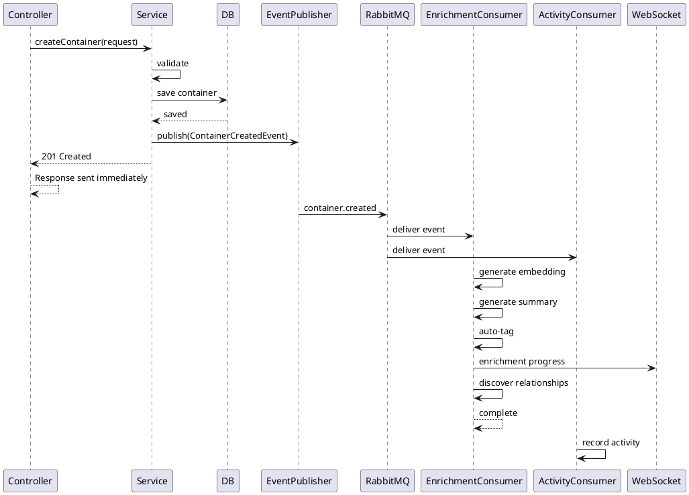

# Event-Driven Architecture

## Overview

ContextOS uses an event-driven architecture for asynchronous operations, primarily AI enrichment, activity tracking, and cross-module communication. Events enable loose coupling between bounded contexts and provide resilience through message persistence and retry.

## Message Broker: RabbitMQ

```yaml
RabbitMQ Configuration:
  host: ${RABBITMQ_HOST:localhost}
  port: 5672
  management_port: 15672
  vhost: /contextos
  
  exchanges:
    container.exchange: topic
    ai.exchange: topic
    activity.exchange: topic
  
  queues:
    container.enrichment: AI enrichment requests
    container.activity: Activity feed updates
    container.search: Search index updates
    ai.enrichment.result: Enrichment completion
    ai.embedding: Embedding generation
    activity.log: Activity feed writer
    dead.letter: Failed messages (retry exceeded)
```

## RabbitMQ Configuration

```java
@Configuration
public class RabbitMQConfig {

    // ============================================
    // Exchanges
    // ============================================
    
    @Bean
    public TopicExchange containerExchange() {
        return new TopicExchange("container.exchange");
    }

    @Bean
    public TopicExchange aiExchange() {
        return new TopicExchange("ai.exchange");
    }

    @Bean
    public TopicExchange activityExchange() {
        return new TopicExchange("activity.exchange");
    }

    @Bean
    public DirectExchange deadLetterExchange() {
        return new DirectExchange("dead.letter.exchange");
    }

    // ============================================
    // Queues
    // ============================================

    @Bean
    public Queue enrichmentQueue() {
        return QueueBuilder.durable("container.enrichment")
            .withArgument("x-dead-letter-exchange", "dead.letter.exchange")
            .withArgument("x-dead-letter-routing-key", "dead.letter")
            .withArgument("x-message-ttl", 300000)  // 5 min
            .build();
    }

    @Bean
    public Queue activityQueue() {
        return QueueBuilder.durable("activity.log").build();
    }

    @Bean
    public Queue embeddingQueue() {
        return QueueBuilder.durable("ai.embedding")
            .withArgument("x-dead-letter-exchange", "dead.letter.exchange")
            .withArgument("x-dead-letter-routing-key", "dead.letter")
            .build();
    }

    @Bean
    public Queue deadLetterQueue() {
        return new Queue("dead.letter");
    }

    // ============================================
    // Bindings
    // ============================================

    @Bean
    public Binding enrichmentBinding() {
        return BindingBuilder
            .bind(enrichmentQueue())
            .to(containerExchange())
            .with("container.#");
    }

    @Bean
    public Binding activityBinding() {
        return BindingBuilder
            .bind(activityQueue())
            .to(activityExchange())
            .with("activity.#");
    }

    @Bean
    public Binding embeddingBinding() {
        return BindingBuilder
            .bind(embeddingQueue())
            .to(aiExchange())
            .with("embedding.#");
    }

    @Bean
    public Binding deadLetterBinding() {
        return BindingBuilder
            .bind(deadLetterQueue())
            .to(deadLetterExchange())
            .with("dead.letter");
    }

    // ============================================
    // JSON Message Converter
    // ============================================

    @Bean
    public Jackson2JsonMessageConverter messageConverter() {
        return new Jackson2JsonMessageConverter();
    }
}
```

## Event Models

```java
// ============================================
// Container Events
// ============================================

public record ContainerCreatedEvent(
    UUID containerId,
    UUID ownerId,
    ContainerType type,
    String title,
    Map<String, String> metadata,
    Set<String> tags
) implements Event {
    @Override
    public String routingKey() { return "container.created"; }
}

public record ContainerUpdatedEvent(
    UUID containerId,
    UUID ownerId,
    Set<String> changedFields,
    Map<String, Object> oldValues,
    Map<String, Object> newValues
) implements Event {
    @Override
    public String routingKey() { return "container.updated"; }
}

public record ContainerDeletedEvent(
    UUID containerId,
    UUID ownerId
) implements Event {
    @Override
    public String routingKey() { return "container.deleted"; }
}

public record ProgressUpdatedEvent(
    UUID containerId,
    UUID ownerId,
    int oldProgress,
    int newProgress
) implements Event {
    @Override
    public String routingKey() { return "container.progress.updated"; }
}

// ============================================
// AI Events
// ============================================

public record EnrichmentRequestedEvent(
    UUID containerId,
    UUID ownerId,
    Instant requestedAt
) implements Event {
    @Override
    public String routingKey() { return "enrichment.requested"; }
}

public record EnrichmentCompletedEvent(
    UUID containerId,
    EnrichmentResult result
) implements Event {
    @Override
    public String routingKey() { return "enrichment.completed"; }
}

public record EmbeddingRequestedEvent(
    UUID containerId,
    String content
) implements Event {
    @Override
    public String routingKey() { return "embedding.requested"; }
}

public record RecommendationRequestedEvent(
    UUID userId,
    UUID contextContainerId
) implements Event {
    @Override
    public String routingKey() { return "recommendation.requested"; }
}

// ============================================
// Activity Events
// ============================================

public record ActivityEvent(
    UUID userId,
    ActivityType type,
    UUID containerId,
    String description,
    Map<String, Object> metadata
) implements Event {
    @Override
    public String routingKey() { return "activity." + type.name().toLowerCase(); }
}

public enum ActivityType {
    CONTAINER_CREATED,
    CONTAINER_UPDATED,
    CONTAINER_DELETED,
    PROGRESS_UPDATED,
    SNAPSHOT_CREATED,
    ENRICHMENT_COMPLETED,
    SEARCH_PERFORMED,
    RECOMMENDATION_VIEWED
}
```

## Event Publisher

```java
@Component
public class EventPublisher {

    private final RabbitTemplate rabbitTemplate;

    public void publish(Event event) {
        String exchange = resolveExchange(event);
        String routingKey = event.routingKey();
        
        rabbitTemplate.convertAndSend(exchange, routingKey, event, message -> {
            message.getMessageProperties().setMessageId(UUID.randomUUID().toString());
            message.getMessageProperties().setTimestamp(Instant.now());
            message.getMessageProperties().setHeader("event-type", event.getClass().getSimpleName());
            return message;
        });
    }

    private String resolveExchange(Event event) {
        return switch (event) {
            case ContainerCreatedEvent e -> "container.exchange";
            case EnrichmentRequestedEvent e -> "ai.exchange";
            case ActivityEvent e -> "activity.exchange";
            default -> "container.exchange";
        };
    }
}
```

## Event Consumers

```java
// ============================================
// Enrichment Consumer
// ============================================

@Component
@RabbitListener(queues = "container.enrichment")
public class EnrichmentConsumer {

    private static final Logger log = LoggerFactory.getLogger(EnrichmentConsumer.class);
    private final EnrichmentOrchestrator orchestrator;
    private final WebSocketController webSocket;

    @RabbitHandler
    public void handleContainerCreated(ContainerCreatedEvent event) {
        log.info("Enrichment requested for container: {}", event.containerId());
        
        try {
            webSocket.sendEnrichmentProgress(event.ownerId(),
                new EnrichmentProgressMessage(event.containerId(), "STARTED", 0));
            
            // 1. Generate embedding
            orchestrator.generateEmbedding(event.containerId());
            
            // 2. Generate summary (for applicable types)
            if (shouldSummarize(event.type())) {
                orchestrator.generateSummary(event.containerId());
            }
            
            // 3. Auto-tag
            orchestrator.autoTag(event.containerId());
            
            // 4. Discover relationships
            orchestrator.discoverRelationships(event.containerId());
            
            webSocket.sendEnrichmentProgress(event.ownerId(),
                new EnrichmentProgressMessage(event.containerId(), "COMPLETED", 100));
            
        } catch (Exception e) {
            log.error("Enrichment failed for container: {}", event.containerId(), e);
            webSocket.sendEnrichmentProgress(event.ownerId(),
                new EnrichmentProgressMessage(event.containerId(), "FAILED", 0));
            throw new AmqpRejectAndDontRequeueException(e); // Send to DLQ
        }
    }
    
    private boolean shouldSummarize(ContainerType type) {
        return switch (type) {
            case BOOK, MOVIE, COURSE, KNOWLEDGE_ASSET -> true;
            default -> false;
        };
    }
}

// ============================================
// Activity Consumer
// ============================================

@Component
@RabbitListener(queues = "activity.log")
public class ActivityConsumer {

    private final ActivityService activityService;

    @RabbitHandler
    public void handleActivity(ActivityEvent event) {
        activityService.recordEvent(event);
    }
}

// ============================================
// Embedding Consumer
// ============================================

@Component
@RabbitListener(queues = "ai.embedding")
public class EmbeddingConsumer {

    private final EmbeddingService embeddingService;
    private final VectorSearchService vectorSearch;

    @RabbitHandler
    public void handleEmbeddingRequest(EmbeddingRequestedEvent event) {
        float[] embedding = embeddingService.generateEmbedding(event.content());
        vectorSearch.storeEmbedding(event.containerId(), embedding);
    }
}
```

## Event Flow Diagrams

### Container Creation Flow



## Retry and Dead Letter Strategy

```yaml
Retry Policy:
  enrichment:
    max_retries: 3
    initial_delay: 5 seconds
    multiplier: 2  # 5s, 10s, 20s
    max_delay: 60 seconds
    
  embedding:
    max_retries: 2
    initial_delay: 2 seconds
    
  activity:
    max_retries: 1
    initial_delay: 1 second

Dead Letter Queue (DLQ):
  - Messages that exceed retry count go to dead.letter
  - DLQ monitored for alerting
  - Manual replay via admin UI
  - DLQ purge after 7 days
```

## Event Sourcing Considerations

```yaml
Event Sourcing Notes:
  - Currently NOT using full event sourcing (would add complexity)
  - Timeline events serve as a lightweight event log
  - Future consideration for V5 if audit/undo requirements grow
  
  Current approach:
    - Events for async processing (not persistence)
    - Timeline events for user-facing history
    - Snapshots for point-in-time recovery
    - Database as source of truth
```

## Monitoring Events

```yaml
Event Monitoring:
  metrics:
    - events.published.total (counter)
    - events.consumed.total (counter)
    - events.failed.total (counter)
    - events.processing.duration (histogram)
    - queue.depth (gauge)
    - dead.letter.count (gauge)
  
  alerting:
    - Queue depth > 1000 for 5 minutes
    - Dead letter messages > 10 per hour
    - Enrichment failure rate > 5%
    - Event processing latency > 30 seconds
```
