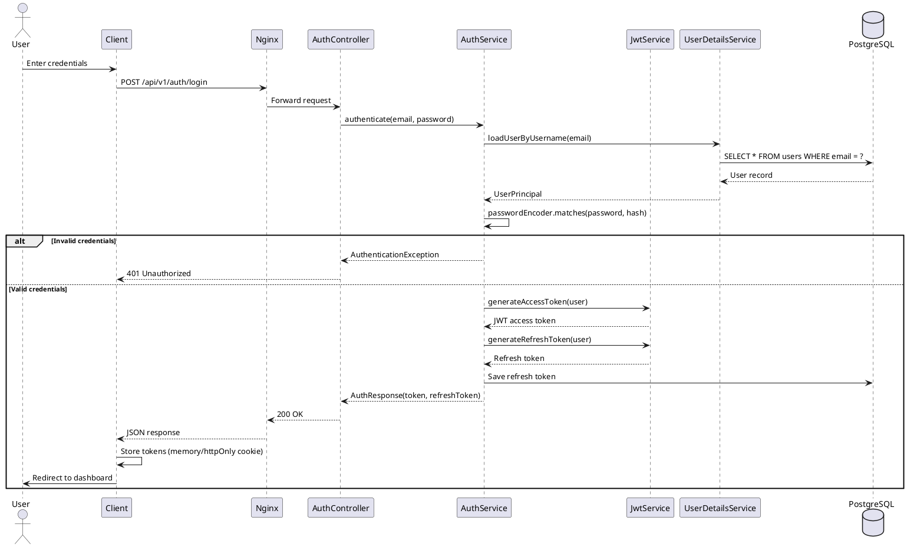

# Security Architecture

## Security Overview

```
┌─────────────────────────────────────────────────────────┐
│                   Client (Browser/Extension)            │
│                     Authorization: Bearer <JWT>          │
└──────────────────────┬──────────────────────────────────┘
                       │ HTTPS
┌──────────────────────▼──────────────────────────────────┐
│                    Nginx (TLS + Rate Limiting)           │
└──────────────────────┬──────────────────────────────────┘
                       │
┌──────────────────────▼──────────────────────────────────┐
│           Spring Security Filter Chain                   │
│                                                          │
│  1. CorsFilter           → CORS policy                   │
│  2. RateLimitFilter      → Rate limiting                 │
│  3. SecurityContextHolder → Authentication context       │
│  4. JwtAuthenticationFilter → JWT validation             │
│  5. ExceptionTranslation  → Auth exception handling      │
│  6. FilterSecurityInterceptor → URL-based authorization  │
└──────────────────────┬──────────────────────────────────┘
                       │
┌──────────────────────▼──────────────────────────────────┐
│                    Application Services                  │
│               @PreAuthorize at method level              │
└─────────────────────────────────────────────────────────┘
```

## Authentication Flow



## JWT Token Design

```java
// Access Token
// Expiry: 15 minutes
// Stored: Client memory (NOT localStorage)
// Sent: Authorization: Bearer <token>
{
  "sub": "user-id-uuid",
  "email": "user@example.com",
  "role": "USER",
  "iat": 1705310000,
  "exp": 1705310900,
  "type": "ACCESS"
}

// Refresh Token
// Expiry: 30 days
// Stored: httpOnly secure cookie
// Sent: POST /api/v1/auth/refresh { refreshToken: "..." }
{
  "sub": "user-id-uuid",
  "jti": "token-id-uuid",
  "iat": 1705310000,
  "exp": 1707899000,
  "type": "REFRESH"
}
```

```java
@Component
public class JwtTokenProvider {
    private final SecretKey accessKey;
    private final SecretKey refreshKey;
    private final long accessExpiration;
    private final long refreshExpiration;

    public JwtTokenProvider(@Value("${jwt.secret}") String secret) {
        byte[] keyBytes = Keys.secretKeyFor(SignatureAlgorithm.HS512).getEncoded();
        this.accessKey = Keys.hmacShaKeyFor(secret.getBytes());
        this.refreshKey = Keys.hmacShaKeyFor((secret + "-refresh").getBytes());
        this.accessExpiration = 900_000;  // 15 min
        this.refreshExpiration = 2_592_000_000L;  // 30 days
    }

    public String generateAccessToken(UserPrincipal user) {
        return Jwts.builder()
            .subject(user.getId().toString())
            .claim("email", user.getEmail())
            .claim("role", user.getRole())
            .claim("type", "ACCESS")
            .issuedAt(new Date())
            .expiration(new Date(System.currentTimeMillis() + accessExpiration))
            .signWith(accessKey)
            .compact();
    }

    public boolean validateToken(String token) {
        try {
            Jwts.parser().verifyWith(accessKey).build().parseSignedClaims(token);
            return true;
        } catch (JwtException e) {
            return false;
        }
    }

    public UUID getUserIdFromToken(String token) {
        Claims claims = Jwts.parser()
            .verifyWith(accessKey)
            .build()
            .parseSignedClaims(token)
            .getPayload();
        return UUID.fromString(claims.getSubject());
    }
}
```

## Security Configuration

```java
@Configuration
@EnableWebSecurity
@EnableMethodSecurity
public class SecurityConfig {

    @Bean
    public SecurityFilterChain filterChain(HttpSecurity http) throws Exception {
        http
            .cors(Customizer.withDefaults())
            .csrf(AbstractHttpConfigurer::disable)
            .sessionManagement(sm -> sm.sessionCreationPolicy(STATELESS))
            .authorizeHttpRequests(auth -> auth
                .requestMatchers("/api/v1/auth/**").permitAll()
                .requestMatchers("/api/v1/health", "/api/v1/info").permitAll()
                .requestMatchers("/api/v1/swagger-ui/**", "/api/v1/api-docs/**").permitAll()
                .requestMatchers("/ws/**").permitAll()
                .requestMatchers("/api/v1/admin/**").hasRole("ADMIN")
                .anyRequest().authenticated()
            )
            .addFilterBefore(jwtAuthFilter, UsernamePasswordAuthenticationFilter.class)
            .exceptionHandling(ex -> ex
                .authenticationEntryPoint((req, res, authEx) ->
                    res.sendError(HttpServletResponse.SC_UNAUTHORIZED, "Unauthorized")
                )
                .accessDeniedHandler((req, res, accessDeniedEx) ->
                    res.sendError(HttpServletResponse.SC_FORBIDDEN, "Forbidden")
                )
            );

        return http.build();
    }

    @Bean
    public PasswordEncoder passwordEncoder() {
        return new BCryptPasswordEncoder(12);  // Strength 12
    }

    @Bean
    public CorsConfigurationSource corsConfigurationSource() {
        CorsConfiguration config = new CorsConfiguration();
        config.setAllowedOrigins(List.of(
            "http://localhost:5173",
            "https://contextos.app"
        ));
        config.setAllowedMethods(List.of("GET", "POST", "PUT", "PATCH", "DELETE", "OPTIONS"));
        config.setAllowedHeaders(List.of("*"));
        config.setAllowCredentials(true);
        config.setMaxAge(3600L);

        UrlBasedCorsConfigurationSource source = new UrlBasedCorsConfigurationSource();
        source.registerCorsConfiguration("/**", config);
        return source;
    }
}
```

## Authorization Model

```java
// Role-based access control
public enum Role {
    USER,       // Standard user - can manage own containers
    PREMIUM,    // Premium user - advanced AI features
    ADMIN       # System administrator
}

// Method-level authorization
@RestController
@RequestMapping("/api/v1/containers")
public class ContainerController {

    // Any authenticated user can access
    @GetMapping
    public ResponseEntity<PageResponse<ContainerListResponse>> list(
        @AuthenticationPrincipal UserPrincipal user,
        ContainerSearchRequest request
    ) { ... }

    // Only the owner OR admin can access
    @GetMapping("/{id}")
    @PreAuthorize("@containerAuth.isOwner(#id, principal) or hasRole('ADMIN')")
    public ResponseEntity<ContainerResponse> getById(@PathVariable UUID id) { ... }

    // Admin only
    @DeleteMapping("/admin/containers/{id}")
    @PreAuthorize("hasRole('ADMIN')")
    public ResponseEntity<Void> adminDelete(@PathVariable UUID id) { ... }
}

@Service
public class ContainerAuthorizationService {

    public boolean isOwner(UUID containerId, UserPrincipal principal) {
        return containerRepository.findById(containerId)
            .map(c -> c.getOwnerId().equals(principal.getId()))
            .orElse(false);
    }
}
```

## Security Headers

```nginx
# Nginx security headers
add_header Strict-Transport-Security "max-age=31536000; includeSubDomains" always;
add_header X-Frame-Options "DENY" always;
add_header X-Content-Type-Options "nosniff" always;
add_header X-XSS-Protection "1; mode=block" always;
add_header Referrer-Policy "strict-origin-when-cross-origin" always;
add_header Content-Security-Policy "
    default-src 'self';
    script-src 'self' 'unsafe-inline';
    style-src 'self' 'unsafe-inline';
    img-src 'self' data: https:;
    connect-src 'self' https://contextos.app wss://contextos.app;
    font-src 'self' data:;
    object-src 'none';
    frame-ancestors 'none';
" always;
```

## Security Checklist

| Security Measure | Status | Implementation |
|---|---|---|
| TLS/HTTPS | ✅ | Nginx with Let's Encrypt |
| JWT with short expiry | ✅ | 15 min access token |
| Refresh token rotation | ✅ | Old refresh token invalidated on refresh |
| Password hashing | ✅ | BCrypt strength 12 |
| Rate limiting | ✅ | Nginx + Spring Filter |
| CORS configuration | ✅ | Whitelist origins |
| SQL injection protection | ✅ | JPA parameterized queries |
| XSS protection | ✅ | CSP headers, React auto-escaping |
| CSRF protection | ✅ | Stateless JWT, Samesite cookies |
| Input validation | ✅ | Jakarta Validation + custom validators |
| Output encoding | ✅ | JSON serialization (not HTML) |
| Secure headers | ✅ | Nginx security headers |
| Dependency scanning | ✅ | Dependabot + OWASP plugin |
| Audit logging | ✅ | All auth events logged |
| MFA support | ✅ | TOTP (V2) |
| Data encryption at rest | ✅ | PostgreSQL TDE / disk encryption |

## Secrets Management

```yaml
Secrets Management Strategy:
  development:
    - .env file (git-ignored template: .env.example)
    - Docker Compose environment variables
  
  staging/production:
    - Environment variables in CI/CD
    - No secrets in code or Docker images
    - Secrets rotated quarterly
  
  critical secrets:
    JWT_SECRET: 512-bit random key
    DB_PASSWORD: 32-char random, rotated quarterly
    RABBITMQ_PASSWORD: 24-char random
    OAUTH_CLIENT_SECRET: Provider-specific
```
