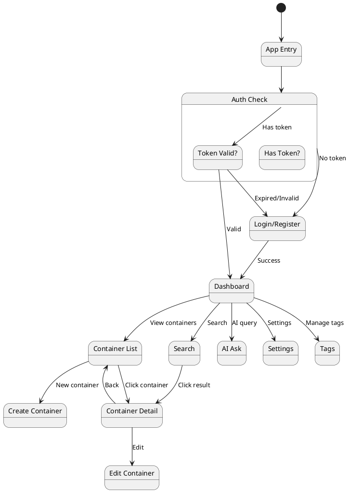

# Frontend Architecture

## Technology Stack

| Technology | Version | Purpose |
|---|---|---|
| React | 18.x | UI framework |
| TypeScript | 5.x | Type safety |
| Vite | 5.x | Build tool, HMR |
| Tailwind CSS | 3.x | Utility CSS |
| TanStack Query | 5.x | Server state, caching |
| Zustand | 4.x | Client state |
| React Router | 6.x | Routing |
| Axios | 1.x | HTTP client |
| Radix UI | Latest | Accessible UI primitives |
| React Hook Form | 7.x | Form management |
| Zod | 3.x | Schema validation |
| date-fns | 3.x | Date utilities |
| recharts | 2.x | Charts and graphs |
| react-markdown | 9.x | Markdown rendering |
| STOMP.js | Latest | WebSocket client |

## Project Structure

```
frontend/
├── index.html
├── vite.config.ts
├── tsconfig.json
├── tailwind.config.ts
├── package.json
├── .env
├── .env.example
│
├── public/
│   ├── favicon.svg
│   └── manifest.json
│
├── src/
│   ├── main.tsx                    # Entry point
│   ├── App.tsx                     # Root component
│   ├── index.css                   # Global styles
│   ├── vite-env.d.ts
│   │
│   ├── config/
│   │   ├── api.ts                  # Axios instance + interceptors
│   │   ├── constants.ts            # App constants
│   │   └── env.ts                  # Environment variables
│   │
│   ├── routes/
│   │   ├── index.tsx               # Route configuration
│   │   ├── ProtectedRoute.tsx      # Auth guard
│   │   ├── PublicRoute.tsx         # Guest-only route
│   │   └── routePaths.ts           # Path constants
│   │
│   ├── layouts/
│   │   ├── DashboardLayout.tsx     # Main authenticated layout
│   │   ├── AuthLayout.tsx          # Login/register layout
│   │   └── components/
│   │       ├── Sidebar.tsx
│   │       ├── Header.tsx
│   │       ├── MobileNav.tsx
│   │       └── Breadcrumbs.tsx
│   │
│   ├── pages/
│   │   ├── auth/
│   │   │   ├── LoginPage.tsx
│   │   │   ├── RegisterPage.tsx
│   │   │   └── ForgotPasswordPage.tsx
│   │   ├── dashboard/
│   │   │   └── DashboardPage.tsx
│   │   ├── containers/
│   │   │   ├── ContainerListPage.tsx
│   │   │   ├── ContainerDetailPage.tsx
│   │   │   ├── ContainerCreatePage.tsx
│   │   │   └── ContainerEditPage.tsx
│   │   ├── tags/
│   │   │   └── TagsPage.tsx
│   │   ├── search/
│   │   │   └── SearchPage.tsx
│   │   ├── ai/
│   │   │   ├── AIAskPage.tsx
│   │   │   └── RecommendationsPage.tsx
│   │   ├── settings/
│   │   │   └── SettingsPage.tsx
│   │   └── NotFoundPage.tsx
│   │
│   ├── components/
│   │   ├── ui/                     # Primitives (Radix-based)
│   │   │   ├── Button.tsx
│   │   │   ├── Input.tsx
│   │   │   ├── Select.tsx
│   │   │   ├── Modal.tsx
│   │   │   ├── Dialog.tsx
│   │   │   ├── DropdownMenu.tsx
│   │   │   ├── Tabs.tsx
│   │   │   ├── Badge.tsx
│   │   │   ├── Card.tsx
│   │   │   ├── Avatar.tsx
│   │   │   ├── ProgressBar.tsx
│   │   │   ├── Skeleton.tsx
│   │   │   ├── Toast.tsx
│   │   │   ├── Tooltip.tsx
│   │   │   └── Command.tsx        # Cmd+K search palette
│   │   │
│   │   ├── container/
│   │   │   ├── ContainerCard.tsx
│   │   │   ├── ContainerForm.tsx
│   │   │   ├── ContainerTimeline.tsx
│   │   │   ├── ContainerSnapshots.tsx
│   │   │   ├── ContainerAIView.tsx
│   │   │   ├── ProgressWidget.tsx
│   │   │   ├── MetadataEditor.tsx
│   │   │   └── ContainersByType.tsx
│   │   │
│   │   ├── tag/
│   │   │   ├── TagBadge.tsx
│   │   │   ├── TagInput.tsx
│   │   │   ├── TagList.tsx
│   │   │   └── TagColorPicker.tsx
│   │   │
│   │   ├── search/
│   │   │   ├── SearchBar.tsx
│   │   │   ├── SearchResults.tsx
│   │   │   ├── SearchFilters.tsx
│   │   │   └── SearchHighlight.tsx
│   │   │
│   │   ├── ai/
│   │   │   ├── AIQuestionInput.tsx
│   │   │   ├── AIAnswerDisplay.tsx
│   │   │   ├── EnrichmentStatus.tsx
│   │   │   ├── RecommendationCard.tsx
│   │   │   └── KnowledgeGraph.tsx
│   │   │
│   │   ├── dashboard/
│   │   │   ├── ActivityFeed.tsx
│   │   │   ├── StatsCard.tsx
│   │   │   ├── RecentContainers.tsx
│   │   │   ├── ProgressSummary.tsx
│   │   │   └── QuickActions.tsx
│   │   │
│   │   └── shared/
│   │       ├── LoadingSpinner.tsx
│   │       ├── EmptyState.tsx
│   │       ├── ErrorBoundary.tsx
│   │       ├── Pagination.tsx
│   │       ├── ConfirmDialog.tsx
│   │       └── PageHeader.tsx
│   │
│   ├── hooks/
│   │   ├── useAuth.ts
│   │   ├── useContainers.ts
│   │   ├── useContainer.ts
│   │   ├── useTags.ts
│   │   ├── useSearch.ts
│   │   ├── useAI.ts
│   │   ├── useRecommendations.ts
│   │   ├── useTimeline.ts
│   │   ├── useSnapshots.ts
│   │   ├── usePins.ts
│   │   ├── useDashboard.ts
│   │   ├── useWebSocket.ts
│   │   ├── useDebounce.ts
│   │   └── useMediaQuery.ts
│   │
│   ├── stores/
│   │   ├── authStore.ts            # Zustand - user auth state
│   │   ├── uiStore.ts              # Zustand - sidebar, theme, modals
│   │   └── searchStore.ts          # Zustand - search state
│   │
│   ├── services/
│   │   ├── authService.ts
│   │   ├── containerService.ts
│   │   ├── tagService.ts
│   │   ├── snapshotService.ts
│   │   ├── timelineService.ts
│   │   ├── pinService.ts
│   │   ├── searchService.ts
│   │   ├── aiService.ts
│   │   ├── dashboardService.ts
│   │   └── userService.ts
│   │
│   ├── types/
│   │   ├── container.ts
│   │   ├── tag.ts
│   │   ├── user.ts
│   │   ├── snapshot.ts
│   │   ├── timeline.ts
│   │   ├── search.ts
│   │   ├── ai.ts
│   │   └── api.ts
│   │
│   ├── lib/
│   │   ├── utils.ts                # cn() helper, formatters
│   │   ├── validators.ts           # Zod schemas
│   │   ├── constants.ts            # Container types, etc.
│   │   └── websocket.ts            # WebSocket manager
│   │
│   └── test/
│       ├── setup.ts
│       ├── mocks/
│       │   ├── handlers.ts
│       │   └── server.ts
│       └── utils/
│           └── testUtils.tsx
```

## Application Flow



## API Client Configuration

```typescript
// src/config/api.ts
import axios, { AxiosError, InternalAxiosRequestConfig } from 'axios';
import { useAuthStore } from '@/stores/authStore';
import { env } from './env';

export const api = axios.create({
  baseURL: `${env.API_BASE_URL}/api/v1`,
  timeout: 30000,
  headers: {
    'Content-Type': 'application/json',
  },
});

// Request interceptor - attach JWT
api.interceptors.request.use((config: InternalAxiosRequestConfig) => {
  const token = useAuthStore.getState().accessToken;
  if (token) {
    config.headers.Authorization = `Bearer ${token}`;
  }
  return config;
});

// Response interceptor - handle token refresh
api.interceptors.response.use(
  (response) => response,
  async (error: AxiosError) => {
    const originalRequest = error.config as InternalAxiosRequestConfig & { _retry?: boolean };

    if (error.response?.status === 401 && !originalRequest._retry) {
      originalRequest._retry = true;

      try {
        const refreshToken = useAuthStore.getState().refreshToken;
        const response = await axios.post(
          `${env.API_BASE_URL}/api/v1/auth/refresh`,
          { refreshToken }
        );

        const { accessToken } = response.data.data;
        useAuthStore.getState().setAccessToken(accessToken);

        originalRequest.headers.Authorization = `Bearer ${accessToken}`;
        return api(originalRequest);
      } catch {
        useAuthStore.getState().logout();
        window.location.href = '/login';
      }
    }

    return Promise.reject(error);
  }
);
```

## Package.json Dependencies

```json
{
  "name": "contextos-frontend",
  "private": true,
  "version": "1.0.0",
  "type": "module",
  "scripts": {
    "dev": "vite",
    "build": "tsc && vite build",
    "preview": "vite preview",
    "test": "vitest",
    "test:ui": "vitest --ui",
    "lint": "eslint src --ext .ts,.tsx",
    "typecheck": "tsc --noEmit"
  },
  "dependencies": {
    "react": "^18.3.0",
    "react-dom": "^18.3.0",
    "react-router-dom": "^6.28.0",
    "@tanstack/react-query": "^5.60.0",
    "zustand": "^4.5.0",
    "axios": "^1.7.0",
    "@stomp/stompjs": "^7.0.0",
    "react-hook-form": "^7.53.0",
    "@hookform/resolvers": "^3.9.0",
    "zod": "^3.23.0",
    "@radix-ui/react-dialog": "^1.1.0",
    "@radix-ui/react-dropdown-menu": "^2.1.0",
    "@radix-ui/react-tabs": "^1.1.0",
    "@radix-ui/react-tooltip": "^1.1.0",
    "@radix-ui/react-toast": "^1.2.0",
    "@radix-ui/react-popover": "^1.1.0",
    "@radix-ui/react-select": "^2.1.0",
    "clsx": "^2.1.0",
    "tailwind-merge": "^2.5.0",
    "date-fns": "^3.6.0",
    "recharts": "^2.13.0",
    "react-markdown": "^9.0.0",
    "lucide-react": "^0.460.0",
    "cmdk": "^1.0.0"
  },
  "devDependencies": {
    "@types/react": "^18.3.0",
    "@types/react-dom": "^18.3.0",
    "@vitejs/plugin-react": "^4.3.0",
    "typescript": "^5.6.0",
    "vite": "^5.4.0",
    "tailwindcss": "^3.4.0",
    "postcss": "^8.4.0",
    "autoprefixer": "^10.4.0",
    "vitest": "^2.1.0",
    "@testing-library/react": "^16.0.0",
    "@testing-library/jest-dom": "^6.6.0",
    "eslint": "^9.0.0",
    "@typescript-eslint/eslint-plugin": "^8.0.0",
    "msw": "^2.6.0"
  }
}
```
