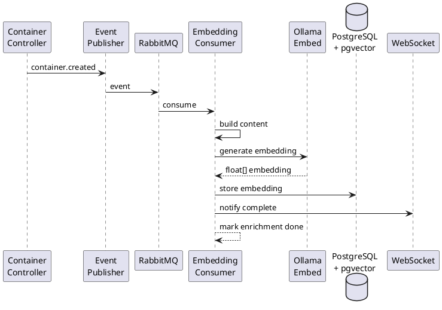

# Embedding Strategy

## Overview

Embeddings are vector representations of container content that enable semantic understanding and similarity search. ContextOS uses Ollama's embedding models to generate high-quality embeddings for all container types.

## Model Selection

| Model | Dimensions | Quality | Speed | Size |
|---|---|---|---|---|
| **nomic-embed-text** (default) | 768 | Good | Fast | 274MB |
| mxbai-embed-large | 1024 | Better | Moderate | 670MB |
| all-MiniLM-L6-v2 | 384 | Fair | Very Fast | 90MB |

**Recommendation:** Use `nomic-embed-text` as default for V2. It provides good quality with reasonable size and speed.

## Embedding Generation

```java
@Service
public class EmbeddingService {

    private final OllamaClient ollamaClient;
    private final VectorSearchService vectorSearch;

    /**
     * Generate embedding for container content.
     */
    public float[] generateEmbedding(String content) {
        // Normalize content for embedding
        String normalized = normalizeContent(content);
        
        // Generate embedding via Ollama
        float[] embedding = ollamaClient.generateEmbedding(normalized);
        
        // L2 normalize for cosine similarity
        return normalizeVector(embedding);
    }

    /**
     * Generate embedding and store in vector index.
     */
    @Transactional
    public void generateAndStore(UUID containerId, String content) {
        float[] embedding = generateEmbedding(content);
        vectorSearch.storeEmbedding(containerId, embedding);
    }

    /**
     * Generate embeddings in batch for efficiency.
     */
    public List<float[]> generateBatch(List<String> contents) {
        return contents.parallelStream()
            .map(this::generateEmbedding)
            .collect(Collectors.toList());
    }

    private String normalizeContent(String content) {
        // Truncate to model's max input (typically 8192 tokens)
        if (content.length() > 32000) {
            content = content.substring(0, 32000);
        }
        
        // Remove excessive whitespace
        content = content.replaceAll("\\s+", " ").trim();
        
        // Remove markdown formatting for cleaner embeddings
        content = content.replaceAll("#+\\s", "")
                        .replaceAll("\\*\\*", "")
                        .replaceAll("__", "");
        
        return content;
    }

    private float[] normalizeVector(float[] vector) {
        float norm = 0.0f;
        for (float v : vector) norm += v * v;
        norm = (float) Math.sqrt(norm);
        
        float[] normalized = new float[vector.length];
        for (int i = 0; i < vector.length; i++) {
            normalized[i] = vector[i] / norm;
        }
        return normalized;
    }
}
```

## Content to Embed

Different container types have different content strategies for embedding:

```java
public class EmbeddingContentBuilder {

    /**
     * Build the text content to embed for a container.
     * More content = better embeddings, but slower generation.
     */
    public String buildContent(Container container) {
        return switch (container.getType()) {
            case BOOK -> buildBookContent((BookContainer) container);
            case MOVIE -> buildMovieContent((MovieContainer) container);
            case GOAL -> buildGoalContent((GoalContainer) container);
            case KNOWLEDGE_ASSET -> buildAssetContent((KnowledgeAssetContainer) container);
            default -> buildGenericContent(container);
        };
    }

    private String buildBookContent(BookContainer book) {
        return String.format("""
            Book: %s by %s
            Genre: %s
            Description: %s
            Status: %s (page %d of %d)
            Tags: %s
            Notes: %s
            """,
            book.getTitle(), book.getMetadata().get("author"),
            book.getMetadata().get("genre"),
            book.getDescription(),
            book.getMetadata().get("readingStatus"),
            book.getMetadata().get("currentPage"),
            book.getMetadata().get("pageCount"),
            getTagString(book),
            truncateNotes(book)
        );
    }

    private String buildMovieContent(MovieContainer movie) {
        return String.format("""
            Movie: %s (%s)
            Director: %s
            Genre: %s
            Description: %s
            Tags: %s
            """,
            movie.getTitle(), movie.getMetadata().get("releaseYear"),
            movie.getMetadata().get("director"),
            movie.getMetadata().get("genre"),
            movie.getDescription(),
            getTagString(movie)
        );
    }

    private String buildGoalContent(GoalContainer goal) {
        return String.format("""
            Goal: %s
            Objective: %s
            Key Results: %s
            Deadline: %s
            Category: %s
            Progress: %d%%
            """,
            goal.getTitle(),
            goal.getDescription(),
            goal.getMetadata().get("keyResults"),
            goal.getMetadata().get("deadline"),
            goal.getMetadata().get("category"),
            goal.getProgressPercentage()
        );
    }

    private String buildAssetContent(KnowledgeAssetContainer asset) {
        return String.format("""
            Knowledge Asset: %s
            Type: %s
            Content: %s
            Source: %s
            Tags: %s
            """,
            asset.getTitle(),
            asset.getMetadata().get("assetType"),
            asset.getDescription(),
            asset.getMetadata().get("source"),
            getTagString(asset)
        );
    }
}
```

## Embedding Pipeline



## Hybrid Search Strategy

```java
@Service
public class HybridSearchService {

    private final EmbeddingService embeddingService;
    private final VectorSearchService vectorSearch;
    private final FullTextSearchService fullTextSearch;
    private final SearchRanker ranker;

    /**
     * Hybrid search combining vector similarity and keyword matching.
     */
    public List<SearchResult> search(String query, UUID userId, SearchRequest request) {
        // 1. Generate query embedding
        float[] queryEmbedding = embeddingService.generateEmbedding(query);

        // 2. Parallel vector and text search
        CompletableFuture<List<VectorSearchResult>> vectorFuture =
            CompletableFuture.supplyAsync(() ->
                vectorSearch.search(queryEmbedding, userId, request.getLimit() * 2));

        CompletableFuture<List<TextSearchResult>> textFuture =
            CompletableFuture.supplyAsync(() ->
                fullTextSearch.search(query, userId, request.getLimit() * 2));

        CompletableFuture.allOf(vectorFuture, textFuture).join();

        List<VectorSearchResult> vectorResults = vectorFuture.join();
        List<TextSearchResult> textResults = textFuture.join();

        // 3. Reciprocal Rank Fusion (RRF)
        return ranker.rrfMerge(vectorResults, textResults, request.getLimit());
    }
}

@Component
public class SearchRanker {

    private static final int RRF_K = 60;

    /**
     * Reciprocal Rank Fusion merge algorithm.
     * Combines multiple ranking signals into one.
     */
    public List<SearchResult> rrfMerge(
        List<VectorSearchResult> vectorResults,
        List<TextSearchResult> textResults,
        int limit
    ) {
        Map<UUID, SearchResult> merged = new HashMap<>();

        // Add vector results with RRF score
        for (int i = 0; i < vectorResults.size(); i++) {
            UUID id = vectorResults.get(i).getContainerId();
            double rrfScore = 1.0 / (RRF_K + i + 1);
            
            merged.merge(id, new SearchResult(id, rrfScore, "VECTOR", 
                vectorResults.get(i).getScore()), 
                (existing, incoming) -> {
                    existing.setScore(existing.getScore() + rrfScore);
                    return existing;
                });
        }

        // Add text results with RRF score
        for (int i = 0; i < textResults.size(); i++) {
            UUID id = textResults.get(i).getContainerId();
            double rrfScore = 1.0 / (RRF_K + i + 1);
            
            merged.merge(id, new SearchResult(id, rrfScore, "TEXT",
                textResults.get(i).getScore()),
                (existing, incoming) -> {
                    existing.setScore(existing.getScore() + rrfScore);
                    existing.getMatchTypes().add("TEXT");
                    return existing;
                });
        }

        // Sort by score descending and limit
        return merged.values().stream()
            .sorted(Comparator.comparingDouble(SearchResult::getScore).reversed())
            .limit(limit)
            .collect(Collectors.toList());
    }
}
```

## Vector Search (pgvector)

```java
@Repository
public interface VectorSearchRepository extends JpaRepository<Container, UUID> {

    @Query(value = """
        SELECT id, title, type, description, 
               1 - (embedding <=> :queryEmbedding) AS similarity
        FROM containers
        WHERE owner_id = :userId
          AND deleted_at IS NULL
          AND embedding IS NOT NULL
        ORDER BY embedding <=> :queryEmbedding
        LIMIT :limit
        """, nativeQuery = true)
    List<VectorSearchProjection> similaritySearch(
        @Param("queryEmbedding) Vector queryEmbedding,
        @Param("userId") UUID userId,
        @Param("limit") int limit
    );

    @Query(value = """
        SELECT id, title, type,
               1 - (embedding <=> :queryEmbedding) AS similarity
        FROM containers
        WHERE owner_id = :userId
          AND deleted_at IS NULL
          AND embedding IS NOT NULL
          AND 1 - (embedding <=> :queryEmbedding) > :threshold
        ORDER BY embedding <=> :queryEmbedding
        LIMIT :limit
        """, nativeQuery = true)
    List<VectorSearchProjection> thresholdSearch(
        @Param("queryEmbedding") Vector queryEmbedding,
        @Param("userId") UUID userId,
        @Param("threshold") double threshold,
        @Param("limit") int limit
    );
}

public interface VectorSearchProjection {
    UUID getId();
    String getTitle();
    String getType();
    double getSimilarity();
}
```
